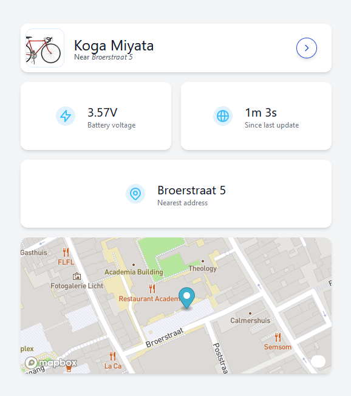

# biketrack-frontend
A front-end application for a bike tracker project. built with [Vue3](https://github.com/vuejs/core) and [Tailwind](https://tailwindcss.com/). Shows the current location of the bike, time since latest update and the current battery voltage.

## Installation 
 1. Clone the repo
 2. Run `npm install`
 3. Create a `.env.local` setting `VITE_API_URL` to the address of the backend api and `VITE_MAPBOX_ACCESS_TOKEN` to your mapbox public key.
